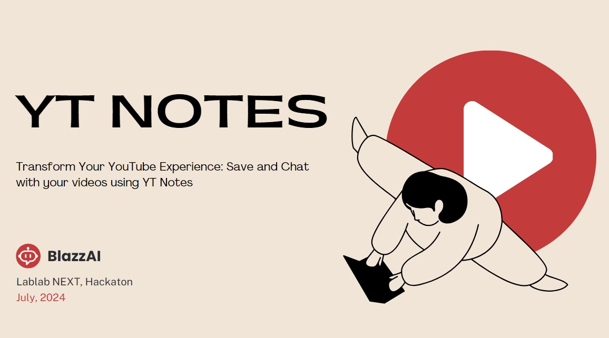

# 🌟YT Notes: Transform Your YouTube Experience

## 🛠️ Build with Low-Code Tool: Langflow



## 📑 Table of Contents
- [Introduction](#introduction)
- [Problem](#problem)
- [Solution](#solution)
- [Technologies](#technologies)
- [Team](#team)
- [Installation](#installation)
- [Roadmap](#roadmap)
- [Hackathon Details](#hackathon-details)

## 📖 Introduction

YT Notes is a Chrome extension that allows users to save and chat with their YouTube videos, enhancing information retention and accessibility. Developed during the Langflow Hackathon in July 2024, our project aims to revolutionize how people interact with educational content on YouTube.

## ❗ Problem

According to recent data, 92% of people watch YouTube videos for information and knowledge. However, many users struggle to retain and reference important information from these videos. With the vast amount of content available, it can be challenging to remember key points or locate specific details later, leading to wasted time searching for videos or rewatching content.

## 💡 Solution

YT Notes addresses these challenges by providing a seamless extension that allows users to:
- Save transcriptions of YouTube videos directly into a database
- Use an intelligent chat feature to ask questions about previously watched content
- Receive accurate responses linked to specific videos

This enhances retention and streamlines the learning process, making information easily accessible and actionable.

## 🧰 Technologies

- [Langflow]()
- LiteLLM
- Chrome Extension Development
- Backend Technologies (specifics to be added)

## 👥 Team

BlazzAI:
- IA Programming: AI developer specialized in LLMs
- Blazzbyte: Full Stack Web Developer

## 🛠️ Installation

### 📋 Previous steps

1. Clone the Repository
- Open your terminal or command prompt.
- Navigate to the directory where you want to clone the repository.
- Run the following command to clone the repository:
 
 ```bash
git clone https://github.com/IA-Programming/YTNotes.git
 ```

2. Navigate into the cloned repository directory:

```bash
cd YTNotes
```

### ⚙️ Setting up the Backend

 - **Installing with pip**
 1. Install the library
 ```bash
pip install -U langflow
 ```
2. Run the frontend UI
```bash
python -m langflow run --no-store
```
 - **Installing with conda**
1. Install the environment
```bash
conda env create -f environment.yml
```
2. Activate the environment
```bash
conda activate langflow
```
> **_Note:_** Now you need to follow the same steps for when running with pip

### 🌐 Download the chrome extension

[Here you can download the extension to try it!]()

## 🗺️ Roadmap

1. Gather feedback from the demo
2. Improve the application based on feedback
3. Advertise through YouTube Ads
4. Monitor and improve efficiency


### 🚀 Hackathon Details

- Application of Technology
- Presentation
- Business Value
- Originality

---

> Developed with passion by BlazzAI for the Langflow Hackathon 2024. Join us in transforming the way we learn from YouTube!
